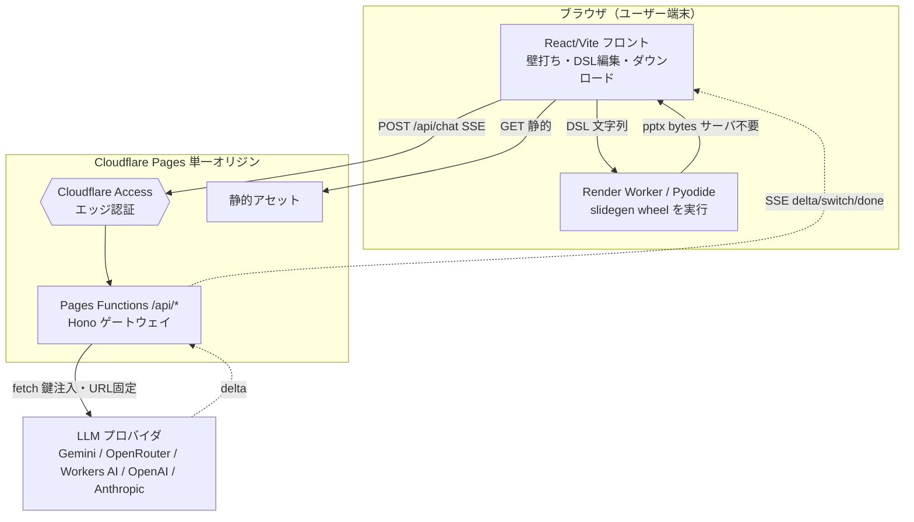

# slidegen

記法(DSL)から **PowerPoint で編集できるネイティブ .pptx** を生成する純 Python ライブラリ ＋
それを使って **AI と壁打ちしてスライドを作る Web アプリ**。

中間記法パターン(MNP)の考え方で、**AI にはスライドの内容（記法）だけを書かせ**、
レイアウト・配色・フォントは「型カタログ」「デザイン制約」「会社テンプレ(potx)」で固定する。
出力は画像化しない（**後から編集できる本物の pptx**）。

> 📋 要件 → [requirements.md](requirements.md)　／　🔧 仕様 → [spec.md](spec.md)　／　🧠 背景思想 → [docs/ppt_design_doc.md](docs/ppt_design_doc.md)
> 🏛 設計判断(ADR) → [docs/adr/](docs/adr/)　／　🚀 デプロイ・運用 → [docs/deployment.md](docs/deployment.md)

---

## 2つの成果物

| | 何 | 場所 | 使い方 |
|---|---|---|---|
| **コアライブラリ** | DSL → 編集可能 pptx（純 Python ＋ CLI） | `slidegen/` | `import slidegen` / `slidegen` コマンド |
| **Web アプリ** | AI と壁打ちしてスライド作成（Cloudflare 無料枠） | `frontend/` ＋ `gateway/` | ブラウザ。pptx 生成はブラウザ内 Pyodide でライブラリを実行 |

ライブラリが中核で、Web アプリは**同じライブラリを wheel 化してブラウザ Pyodide で動かす**
（＝サーバで pptx を作らない）。

## アーキテクチャ

要点は3つ:

- **重い pptx 生成はブラウザ内 Pyodide** で実行 → 無料枠の Worker CPU 制限を回避（[ADR 0003](docs/adr/0003-browser-pyodide-rendering.md)）。
- **LLM 中継は Pages Functions** としてフロントと**同一オリジン**配信 → Cloudflare Access の Cookie 認証が成立（[ADR 0001](docs/adr/0001-same-origin-pages-functions.md)）。
- 認証は **Cloudflare Access**（エッジ）＋ ゲートウェイ内 JWT 検証（`aud` 必須・フェイルクローズ）の多層防御。



<details><summary>ASCII 版（Mermaid が描画されない環境向け）</summary>

```
ユーザー（ブラウザ）
  │
  ├─ 静的配信 ───────────────▶ Cloudflare Pages（React/Vite フロント）
  │
  ├─ 壁打ち / DSL生成
  │     POST /api/chat (SSE)
  │        └─▶ Cloudflare Access（エッジ認証）
  │              └─▶ Pages Functions /api/*（Hono ゲートウェイ）
  │                    ・Access JWT 検証 / レート制限 / 入力上限
  │                    ・鍵を注入して LLM へ中継（エンドポイントURL固定＝SSRF防止）
  │                          └─▶ LLM（Gemini / OpenRouter / Workers AI / OpenAI / Anthropic）
  │     ◀── SSE: delta / switch / done ──────┘
  │
  └─ pptx 生成（サーバ不要・無料枠CPU回避）
        DSL ─▶ Render Worker（Pyodide）= slidegen wheel.render_to_bytes ─▶ pptx をダウンロード
                 ▲ wheel は slidegen/（純Python）を uv build したもの
```
</details>

## クイックスタート

### コアライブラリ / CLI（Python は **uv 統一**・[ADR 0002](docs/adr/0002-uv-for-python-packaging.md)）

```bash
uv sync                                            # 仮想環境＋依存
uv run --extra dev pytest tests/ -q                # 本体テスト
uv run slidegen build examples/sample.slide -o out.pptx
uv build                                           # wheel 化（= bash tools/build_wheel.sh 相当）
```

> 配布済み wheel の**利用者**側は uv 不要（`pip install slidegen-0.1.0-py3-none-any.whl` でも入る）。
> ただし wheel に `examples/` `docs/` は同梱しないため、`pip install` 先にサンプルは無い。

### Web アプリ（ローカル開発）

```bash
bash tools/build_wheel.sh                                                  # wheel を frontend/public/wheels と .env.local へ
cd gateway && npm i && cp .dev.vars.example .dev.vars && npx wrangler dev  # :8787（.dev.vars に DEV_BYPASS_AUTH=1）
cd frontend && npm i && npm run dev                                        # :5173（/api → :8787 を vite proxy）
```

本番デプロイ・運用・セキュリティは [docs/deployment.md](docs/deployment.md)。

## CLI

```bash
slidegen build deck.slide -o deck.pptx [--template company.potx]   # 記法 → pptx
slidegen sync  deck.slide deck.pptx [--apply]                      # 手編集の文言差分を .slide に反映
```

`python -m slidegen build ...` でも同じ。従来の `python -m slidegen.cli` / `.sync` も後方互換で動く。

## ライブラリとして使う（アプリのバックエンド）

ディスクを介さず、メモリで pptx の bytes を得られる（HTTP レスポンスにそのまま載せられる）。

```python
import slidegen

data = slidegen.render_to_bytes(open("deck.slide").read())  # → bytes
prs  = slidegen.render_text(text)                           # → python-pptx の Presentation
path = slidegen.render_file("in.slide", "out.pptx")         # → 保存先 Path
```

API 仕様は [spec.md](spec.md) §2。

## ディレクトリ早見

```
slidegen/   コアライブラリ（parser / render*.py / theme / api / cli）。RENDERERS = 100 型
gateway/    Hono LLM 中継（providers / stream / auth / ratelimit / index / pages）
frontend/   React/Vite。App.tsx(フェーズ駆動) / render/(Pyodide) / ingest.ts / functions/(本番API)
tools/      build_wheel.sh（wheel 化）/ pyodide_spike.mjs（STEP0 関門）
tests/      第1層 pytest(test_invariants) ＋ chart-DSL ガード ＋ 第2層 visual.py
examples/   サンプル記法(.slide)
docs/       要件補助・仕様補助・ADR・設計・型カタログ・デプロイ
```

## ドキュメント地図

| doc | 内容 |
|---|---|
| [requirements.md](requirements.md) | 要件（何を・なぜ） |
| [spec.md](spec.md) | 仕様（どう動くか）の索引兼サマリ |
| [docs/ppt_design_doc.md](docs/ppt_design_doc.md) | 背景思想（MNP・3層責任分界・デザイン制約・編集可能性 §2-bis） |
| [docs/adr/](docs/adr/) | アーキテクチャ決定記録（ADR） |
| [docs/type_catalog.md](docs/type_catalog.md) | 型カタログ（9基底 × variant の決定版） |
| [docs/system_prompt.md](docs/system_prompt.md) | DSL/記法リファレンス（設計参照。ライブは `frontend/src/prompts.ts`） |
| [docs/type_authoring.md](docs/type_authoring.md) | Web/画像/pptx → 記法 or 新型のワークフロー |
| [docs/test_driven_workflow.md](docs/test_driven_workflow.md) | テスト駆動の作業フロー |
| [docs/deployment.md](docs/deployment.md) | デプロイ / ローカル開発 / 制約 / セキュリティ |

## 開発・テスト

```bash
make test     # 第1層: 構造インバリアントの pytest（要: source .venv/bin/activate）
make visual   # 第2層: モンタージュ生成 → 目視
uv run --extra dev pytest tests/ -q                       # 単発はこちらが手軽
cd gateway  && npx tsc --noEmit && npx vitest run         # ゲートウェイ
cd frontend && npx tsc --noEmit && npx vitest run && npm run build && npm run typecheck:functions
```

新しい型を**テスト駆動**で増やす手順は [docs/test_driven_workflow.md](docs/test_driven_workflow.md)。

## 対応する型（計 100 型）

「**9つの基底レイアウト × variant（ラベル/配置/強調位置）× 中身**」の3軸分解で広いカタログを吸収する設計。
個別型を量産しない。網羅の**単一情報源は `RENDERERS`**:

```bash
uv run python -c "import slidegen, slidegen.render as r; print(len(r.RENDERERS))"   # → 100
```

代表例: `title` / `section` / `agenda` / `bullets`・`compare` / `cards` / `kpi` / `process` / `table`・
`matrix` / `cycle` / `pyramid` / `timeline`・`bar_chart` / `line_chart` / `clustered_bar`・`swot` / `venn2` / `bmc`。
一覧と実装ステータスは [docs/type_catalog.md](docs/type_catalog.md)。

## 設計の3層（責任分界）

| 層 | 担当 | 実装箇所 |
|---|---|---|
| コンテンツ（記法） | AI が書く | `docs/system_prompt.md` / `frontend/src/prompts.ts` |
| 構造（どう配置） | 型カタログ | `slidegen/render*.py` の `render_<type>()` |
| 見せ方（何を禁じるか） | デザイン制約 | `slidegen/theme.py` ＋ テスト第1層が常時監視 |
| ブランド書式 | potx | `build(..., template=...)` |

## ロードマップ / 未実装

課題・ネクストアクションは [docs/backlog.md](docs/backlog.md) に優先度順で集約。主な項目:
potx 本連携（theme → potx テーマ色）、技術図 Mermaid 連携、pptx → DSL シリアライザ、
本物のサムネイル（サーバ側 LibreOffice）、テンプレの IndexedDB 永続化、i18n、
モデルカタログの保守性、DSL 解説のドリフト対策。
